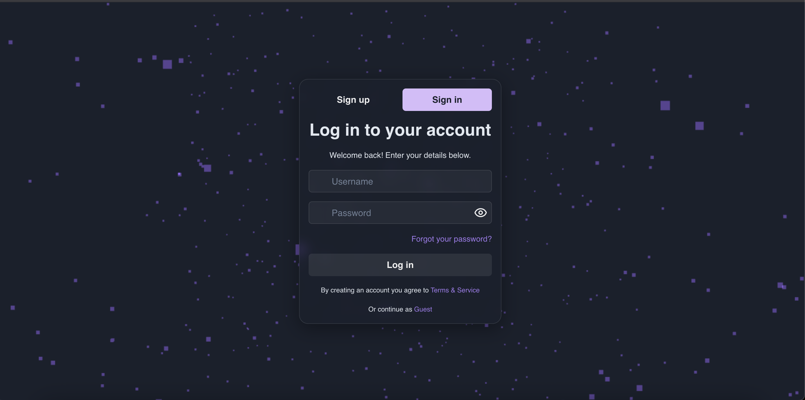
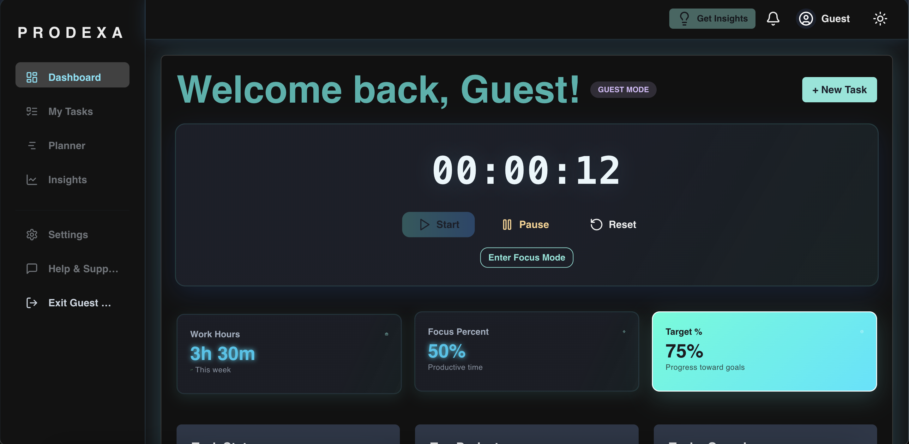
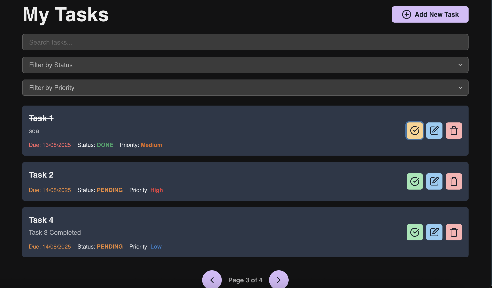
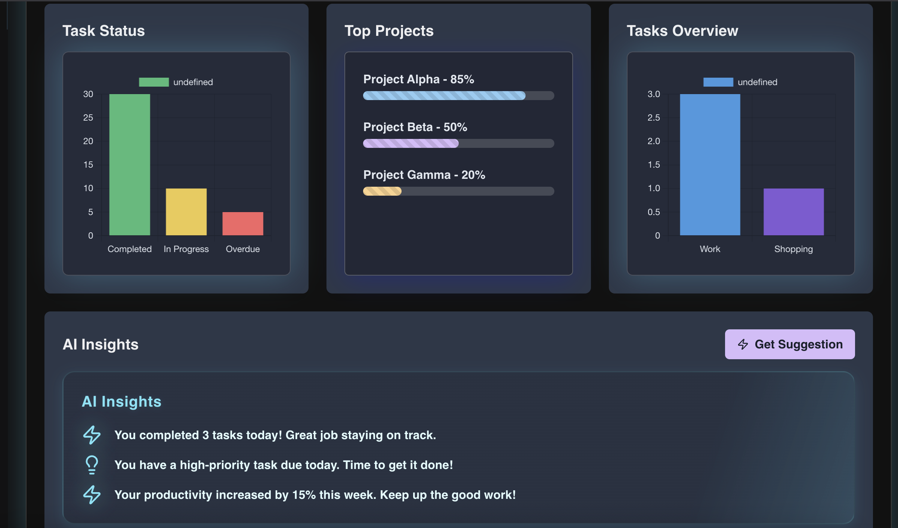
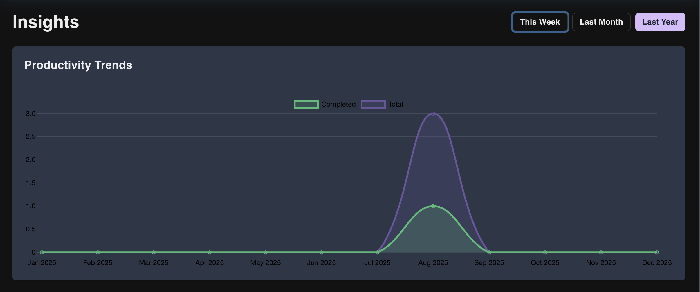
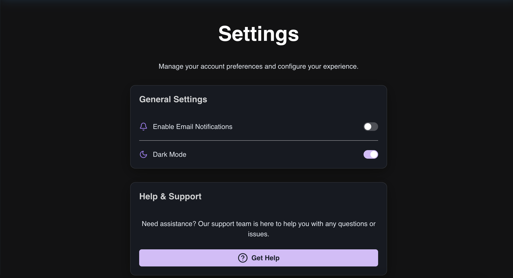
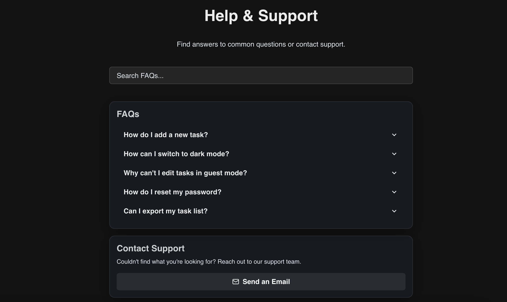

# AI Productivity Dashboard

AI-powered productivity dashboard built with Django (backend) and React (frontend).

## ✨ Features

- 🔐 User authentication and profile management
- ✅ Task and project management with deadlines and statuses
- 🤖 AI-powered insights and task suggestions
- 📊 Interactive charts and analytics on productivity
- 🔔 Notifications and ⏳ focus timer features
- 📱 Responsive UI for desktop and mobile


## 🖼 Screenshots

### Login Page


### Dashboard


### My Tasks


### Charts / Analytics


### AI Insights


### Settings Page


### Help / Guide



## 🛠 Tech Stack

- **Backend:** Django, Django REST Framework, Celery (for async tasks)
- **Frontend:** React, Chakra UI, Tailwind CSS
- **Database:** PostgreSQL (recommended for production), SQLite for local dev
- **AI:** OpenAI API integration for AI insights

---

## 🚀 Getting Started

### Prerequisites

- Python 3.8+
- Node.js 16+
- PostgreSQL (optional, SQLite is default for development)
- Git

---

## 📥 Installation

### 1️⃣ Clone the repo

git clone https://github.com/amanshinde1/ai-productivity-dashboard.git
cd ai-productivity-dashboard


---

## ⚙️ Backend Setup (Django)

1. **Create and activate virtual environment**

python -m venv venv

source venv/bin/activate  # On Windows use `venv\Scripts\activate`


2. **Install backend dependencies**

pip install -r backend/requirements.txt


3. **Set up environment variables**
- Copy the example environment file:
  ```
  cp .env.example .env
  ```
- Open `.env` and fill in your values:
  ```
  SECRET_KEY=your_django_secret
  DEBUG=True
  DB_ENGINE=django.db.backends.sqlite3
  DB_NAME=db.sqlite3
  OPENAI_API_KEY=sk-your-own-openai-key
  ```
  ⚠️ **Do not commit `.env` to GitHub** — it’s already in `.gitignore`.

4. **Run database migrations**

python manage.py migrate


5. **Start the Django development server**

python manage.py runserver

The backend will now be running at:  
[**http://localhost:8000/**](http://localhost:8000/)

---

## 💻 Frontend Setup (React)

1. **Install frontend dependencies**

cd frontend
npm install


2. **Create frontend `.env` file**  
(if needed for API endpoint config)
- Create `.env`:
  ```
  touch .env
  ```
- Add:
  ```
  REACT_APP_API_URL=http://localhost:8000/api/
  ```

3. **Start the frontend**

npm start

The frontend will now be running at:  
[**http://localhost:3000/**](http://localhost:3000/)

---

## 🤖 Enabling AI Features

This project requires your own **OpenAI API Key** for AI-powered suggestions.

1. [Sign up at OpenAI](https://platform.openai.com/)
2. [Generate an API key](https://platform.openai.com/account/api-keys)
3. Add it to your `.env` file in the backend:

OPENAI_API_KEY=sk-your-own-key

4. Restart the backend server.

If no API key is provided, the app will return the default message:  
`"Plan your day wisely."`

---

## 🏃 Running Backend & Frontend Together

- Backend: `python manage.py runserver` (port 8000)
- Frontend: `npm start` (port 3000)

Open your browser at [**http://localhost:3000/**](http://localhost:3000/) to use the application.

---

## 🌐 Deployment

- **Backend** → Render, Railway, or Heroku  
Set your environment variables (`.env` content) in the hosting provider’s dashboard.
- **Frontend** → Netlify or Vercel  
Set `REACT_APP_API_URL` in environment settings to point to your live backend.

⚠️ **Never commit `.env` to your repository**  
Your `.env.example` contains placeholders for safe sharing.

---

## 📜 License

This project is licensed under the MIT License — you can do almost anything with it, but attribution is appreciated.

---

## 🙌 Contributing

Pull requests are welcome. For major changes, please open an issue first to discuss.

---

**Author:** [Aman Shinde](https://github.com/amanshinde1)  
**Repository:** [AI Productivity Dashboard](https://github.com/amanshinde1/ai-productivity-dashboard)

